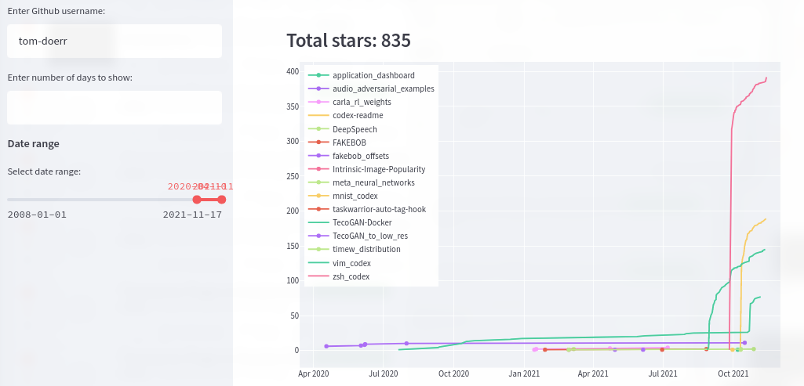

<h1 align="center"> 📈 github_stats </h1>
<p align="center">
    
    <p align="center">
        Website: https://share.streamlit.io/tom-doerr/github_stats/main/main.py?username=tom-doerr
    </p>
</p>


## What is it?
This app allows you to plot the number of Github stars received over time for a user.
## How do I use it?
1. Enter a Github username in the sidebar.
2. Select a date range with the slider.
## How does it work?
1. Get user's repo names from Github API
2. Get repo's star counts from Github API
3. Plot stars over time
## How do I get the app?
1. Clone the repo:
```
git clone git@github.com:tom-doerr/github_stats.git
```
2. Install the dependencies:
```
pip install -r requirements.txt
```
3. Run the app:
```
streamlit run github_stats/main.py
```

